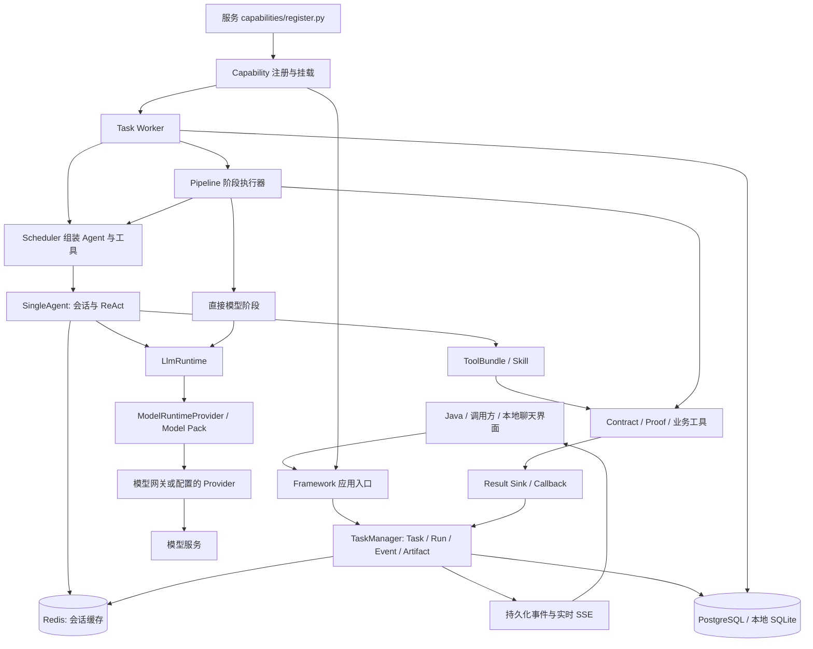

**Aituge Framework 当前架构与扩展位置**

以远端 main `879d6fefe23e20be4597e070590a20e6d71d9daa` 为基线，2026-09-14 核对。此文梳理实际代码，不把规划中的能力当成已经上线的功能。本轮先处理目录和无争议冗余，后续新功能应沿以下边界接入。

**系统边界**

仓库包括通用 Agent 框架、产品组装入口、模型基础设施和若干业务服务。Java 和主产品前端在相邻仓库；本仓库的 frontend/simple-chat 是本地聊天界面，并非完整产品前端。

图示表达调用关系，不表示所有调用都走完全相同的路径。例如单 Agent API 可直接调用 SingleAgent，发票/考勤识别通过专用 router，Pipeline 的 deterministic/gateway 阶段也可以直接调用服务。

**模块责任与阅读入口**

| 模块 | 实际责任 | 先读这些文件 |
| --- | --- | --- |
| 应用组装 | 挂载聊天、调度、任务、专用业务 API，初始化数据库和能力 | `backend/local_code_chat_app.py`、`backend/simple_chat_app.py` |
| 进程运行 | supervisor 启动 API 和 Worker；独立 Worker 也可单独启动 | `backend/framework_runtime.py`、`backend/task_manager/runtime/worker.py` |
| 能力挂载 | 加载显式服务入口，注册任务、Agent、技能、工具、Pipeline、结果接收器 | `backend/capability_mount.py` |
| TaskManager | 创建任务、运行尝试、事件、产物、取消、人工确认、结果状态 | `backend/task_manager/service.py`、`models.py`、`api.py` |
| Worker / 配额 | 领取持久化 Run、租约和心跳、资源配额、用户调度顺序 | `backend/task_manager/runtime/worker.py`、`quota.py`、`fencing.py` |
| Pipeline | 依赖图、阶段结果、重试、batch、人工介入、最终产物 | `backend/task_manager/pipeline/models.py`、`executor.py`、`store.py` |
| Scheduler | 将 AgentProfile、Task 上下文、技能和工具组合为运行请求 | `backend/scheduling/scheduler/service.py` |
| SingleAgent | 会话恢复、上下文压缩、ReAct 循环、工具调用与模型输出 | `backend/single-agent/service/agent/single_agent_runner.py`、`agent/react_agent.py` |
| 模型调用 | 文本及流式调用、统一 usage/完成结果、观测记录 | `backend/single-agent/service/conversation/llm_runner.py` |
| 模型配置/网关 | 模型组件与 pack、路由、连接重试和熔断 | `aituge_model/config/`、`aituge_model/gateway/` |
| 工具/技能 | 工具工厂、运行期 ToolBundle、技能包与提示上下文 | `backend/tool/registry/`、`backend/tool/bundle.py`、`backend/skill/` |
| 本地 RAG | 示例文件导入、内存检索和 search/catalog/grep/fetch 工具 | `backend/data/RAG/tool_retrieval/` |
| 观测 | 任务和模型调用记录、查询及 Trace 关联 | `backend/model_observability/`、`backend/task_manager/observability_internal/` |

Task 是用户业务工作的持久化身份；Run 是该 Task 的一次执行；StageRun 是 Pipeline 某个阶段的执行；Artifact 是阶段或任务的输出；Event 是状态和流式进展。新增业务字段优先进入业务输入/产物模型，不应直接扩张所有任务共用的数据表。

**业务能力地图**

| 业务 | 业务代码 | 注册到 Framework 的能力 | 部署注意点 |
| --- | --- | --- | --- |
| Contract | `services/contract/src/contract/` 与 `capabilities/` | `contract.review.run`、`contract.party-resolution.run`、`contract.grounded.answer`，对应多个 Pipeline | 独立服务和 Framework 能力侧均有业务代码；能力入口需在 API 与 Worker 同时加载 |
| Proof | `services/proof/src/proof/` 与 `capabilities/` | `proof.qa.chat`、`proof.audit.run`、`proof.policy.mutate`、`proof.conflict.audit` | 服务拥有制度数据、解析、检索和业务结果；框架负责任务执行 |
| Travel / 报销表单 | `services/travel-assistant/capabilities/register.py` | `workflow.assistant.chat`，两个表单 workflow、apply_form_changes/start_workflow 工具 | 只有能力适配器，没有独立 FastAPI 服务；镜像复制了源码，默认 Compose 的能力列表未包含它 |
| 发票/考勤识别 | `backend/invoice_recognition.py`、`backend/attendance_recognition.py` | 专用 Framework router | main 新增，当前硬编码挂载在通用入口 |
| OCR | `services/contract-ocr/` | 独立文档转换/识别 HTTP 服务 | PaddleOCR/PaddlePaddle 环境独立，不能用 Framework 环境的通过情况代替 OCR 验收 |
| Smoke | `services/smoke/` | `smoke.echo.chat` 与确定性回声工具 | 能力挂载/端到端连通验证，保留 |

结构化表单的通用实现位于 `backend/single-agent/service/structured_form/`。业务定义字段和 workflow，`fast_path.py` 处理明确的单字段修改，其他情况交给 Agent + 表单工具，结果作为结构化指令交给 Java。它不负责提交最终业务单据。

**新增功能应放在哪里**

| 新功能形式 | 首选入口 | 需要定义 |
| --- | --- | --- |
| 新问答或单 Agent 任务 | 新服务 capability 的 `register_task` / `register_agent` | input_model、消息字段、Agent、模型包选择、工具/技能 |
| 多阶段审查或处理链 | `register_pipeline` + `register_stage_handler` | 阶段依赖、输入/输出 schema、artifact_type、timeout、retry/failure_policy |
| 单次结构化模型判定 | Pipeline `direct_model` 阶段 | 稳定输出模型及验证、LlmCompletionResult，不引入 ReAct 工具循环 |
| 新业务 HTTP 工具 | `register_http_tool` | 输入模型、服务路径、超时、响应限制 |
| 本地确定性工具 | `register_local_tool` | ToolProviderConfig → ToolBundle 工厂和 cleanup |
| 新表单办理业务 | FormWorkflowDefinition + capability | 字段、可写规则、枚举、业务上下文、结构化变更结果 |
| 新业务持久化 | 业务服务的 application / persistence | 数据模型、迁移、幂等与结果回传 |
| 新模型或本地模型包 | `aituge_model/config/components.yaml` 和 `packs/` | 模型组件及 LLM/embedding/reranker 组合 |
| 新任务结果回传 | `register_result_sink` | task_type 对应接收器及重复回传处理 |

Pipeline 已支持 agent、direct_model、batch、deterministic、gateway、finalizer 六类阶段，以及重试、人工确认和失败策略。新增流程应优先复用这些接口；只有存在明确无法表达的执行语义时，才修改通用执行器。

新能力的最小接入链是：业务 `register.py` → 输入/输出模型 → Agent/工具或 Pipeline → 结果接收器 → API 与 Worker 的同一能力清单 → 离线测试 → 独立依赖集成验收。代码进入镜像不等于能力已注册。

**当前需要整理的架构接缝**

1. `local_code_chat_app.py` 同时承担演示入口与产品组装，且关闭嵌入 Contract 仍会先 import Contract。下一步应提供通用 Framework app 和产品组装层，让业务 router 由产品选择；本轮未改变入口行为。
2. `services/contract/capabilities/register.py:925` 从 `services/contract/scripts/contract_risk_stage66_direct_e2e.py` 导入实际执行代码。这个脚本不能删除；应先把生产逻辑搬到稳定 application/runtime 模块，再让 CLI 和 capability 共同调用。
3. `backend.*` 与 `task_manager` / `service` 等顶层包并存，靠 PYTHONPATH/sys.path 组装。下一步统一包名时要一次梳理所有 entrypoint、Docker COPY 和动态注册路径，不能只重命名目录。
4. Framework 的 TaskManager/LLM runtime 和部分业务文件较大。宜分开“状态变更、执行协调、事件发布、模型适配”，但先稳定现有测试替身和协议。
5. 默认 Compose 同时启动 supervisor 内的 10 个 Worker 与 20 个独立 Worker。后续明确一种拓扑，再修改连接预算与扩容配置。
6. `common/knowledgebase/vectordb/` 的旧连接描述类与现行 RAG/Proof 检索并存。直接 AST 引用少不等于对外调用不存在；先确定公开 API 和可选后端范围，再删除整组遗留模块。

**资源与验证约定**

清理后 prompt 和 i18n 使用 `backend/resources/`；tokenizer 使用 `backend/single-agent/resources/tokenizer/`。本轮保留这些现有加载路径，仅删除另一份完全相同的资源。

根测试入口统一由 pytest.ini 管理；业务服务测试保持各自 pyproject.toml。live 测试默认跳过，显式设置 AITUGE_RUN_LIVE_TESTS=1 才运行；执行前还应指定测试服务地址并维护与当前协议一致的请求。失败用例不能通过删除来消除。

本轮清理前后验证与功能状态详见 [清理记录](maintenance/2026-09-14-cleanup.md)。历史合同阶段日志见 [归档索引](archive/README.md)。架构扩展前优先完成剩余 10 项 main 基线失败的归因与协议统一；本轮不改变业务判定规则。

附件识别与语音输入的参考实现核查及拟定接入边界见 [PAI-RAG 输入能力分析](design/2026-09-14-pairag-input-capabilities.md)；该文中的设计尚未实现。

会话附件基础能力已开始迁入 `backend/document_processing/`（异步 MinerU 适配器）。模块分工与 frontframe/Java/Proof 的首接方案见 [会话附件接入设计](design/2026-09-14-chat-attachments.md)。三端附件流程尚未上线。

2026-09-14 方案收敛：附件实现将统一到 `backend/attachments/` 单目录；不再新建并列 `backend/tool/attachments/`。部署资产统一使用工作区顶层 `mineru/`。最新实施边界与按钮/拖拽上传计划以 [制度问答会话附件最小接入计划](design/2026-09-14-chat-attachments.md) 为准。
