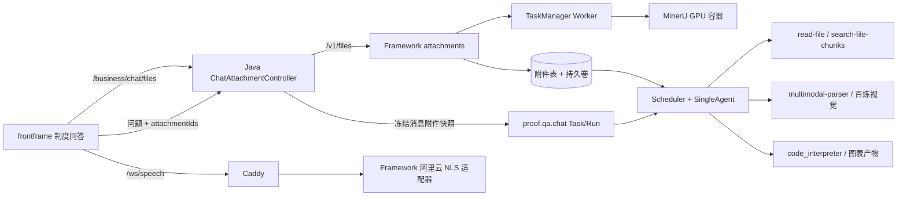

# 制度问答附件与语音输入初版架构

更新于 2026-09-15。本文件记录当前已经落地的初版，不再是待实施计划。Framework 基线为远端 `main` 提交 `879d6fe`；附件源码基线、补丁和逐文件对应关系记录在 `docs/maintenance/2026-09-14-attachments-source.json`。语音能力来自工作树 `aituge-main-voice-input` 与 `frontframe-voice-input`。

## 边界

附件只属于聊天消息和会话，不自动写入正式制度库。Python 统一拥有原件、上传会话、解析结果、分块、引用和清理；Java 保存消息中的附件快照并代理文件接口；frontframe 只管理选择、拖拽、状态、预览和发送交互。语音输入只把麦克风音频转成可编辑文字，之后仍走原有文本问答链路。

后端 `frontend/simple-chat/index.html` 是开发调试页。语音工作树中为它实现的第二套浏览器录音代码没有迁入，因为正式入口是 frontframe，复制该实现会造成两套前端状态机；Framework 的 `/api/speech/config` 和 `/ws/speech` 已挂载并有路由测试。

## 运行架构

创建 Task 负责持久化请求与附件快照，Worker 创建可执行 Run 后才组装 Agent 工具。文件读取本身仍是 Tool；Task/Run 的作用是保证排队、重试和恢复时使用同一批附件，不会夹带后来上传的文件。

## 目录责任

- `backend/attachments/`：文件 API、数据库模型、本地/可选 OSS 存储、分片上传、解析任务、MinerU 适配、读取/搜索/视觉工具和表格原件映射。
- `backend/speech_recognition/`：供应商无关会话协议及阿里云 NLS 实现。模型元数据和凭证通过 `aituge_model` 的统一注册与 secret 目录解析。
- `services/proof/capabilities/register.py`：只声明 `ProofQaInput.attachments` 和制度问答已有工具，不复制文件服务。
- `Javabackend/.../chat/attachment/`：透明代理、消息附件校验、引用 Outbox。消息表保存附件 JSON 快照；引用更新按 owner/revision 幂等。
- `frontframe/src/features/chat/`：一个输入框内组合附件和语音状态。文件选择与拖拽共用 `useChatAttachments`；上传并发为 3。
- `frontframe/src/features/speech-recognition/`：麦克风采集、16 kHz PCM 重采样、流式 WebSocket 和录音动态 UI。
- 工作区 `mineru/`：模型权重、离线镜像包和校验清单；镜像构建定义跟 Framework，正式服务编排在 `aituge-deployment-config`。

## 接口与行为

Java 对浏览器暴露 `/business/chat/files/**`，透明转发 Framework `/v1/files/**`。Framework 支持普通上传、信息/原件/文本/分块读取、状态事件、删除、分片创建/查询/上传/合并/取消和引用设置。默认聊天附件 7 天、上传会话 24 小时；到期且引用为零才可清理。

前端单文件限制 10 MiB，4 MiB 以上使用 2 MiB 分片。附件卡片按类型显示图标、名称、大小、上传或识别状态、成功对勾、失败原因、重试与移除；点击卡片可预览图片、视频或文本，其余格式显示下载入口。仅附件发送时使用默认提问。上传/识别未完成或语音录制中，按钮和回车都不能发送。

PDF 和图片文档走 MinerU；文本、DOCX、PPTX、CSV、XLS/XLSX 走本地解析器。旧 DOC/PPT 明确失败并提示转换。无文字图片仍标记视觉可用，由 `multimodal-parser` 调用 `qwen3-vl-plus`。工具定位使用 `file_id`，文件名只展示。长文档可分页读取并按关键词搜索。

Excel/CSV 原件以 `file_id + 扩展名` 放入当前 Run 的代码目录；制度问答默认已有 `code_interpreter`。执行器可读取所有工作表，计算结果，并通过现有 ArtifactPublisher 发布 PNG/HTML 等图表产物。

语音公开接口为 `/api/speech/config` 和 `/ws/speech`。服务端每实例最多 8 个流式会话；正式部署由 Caddy 同源代理，因此浏览器默认不需要单独配置 WebSocket 地址。麦克风要求 HTTPS 或 localhost。

## 部署和迁移

`aituge-deployment-config/environments/platform/.env.example` 提供 `CHAT_ATTACHMENTS_ENABLED`、`SPEECH_RECOGNITION_MAX_CONCURRENCY`、`MINERU_IMAGE` 和 `MINERU_MODELS_DIR`。`scripts/platform.sh` 在附件开关开启时自动启用 Compose 的 `attachments` profile。Framework API 与 Worker 共用附件持久卷和模型 secret；MinerU 单独占用一张 NVIDIA GPU。Caddy 将语音路径转发到 Framework，其他聊天请求仍进入 Java。

迁移时需要一起备份 Java MySQL、Framework PostgreSQL/附件表和 `python-framework-data` 持久卷。先恢复数据库和附件卷，再启动 MinerU、Framework/Worker、Java、frontframe；消息附件按稳定 file_id 重连。镜像、模型 revision 和校验值保持固定。

## 已验证

- frontframe：86 个测试文件、495 项测试，TypeScript、ESLint、Next.js 生产构建通过。
- Python：附件 API/生命周期/解析、语音协议/模型配置共 26 项通过；另有多工作表计算和 PNG 图表发布回归通过。
- Java：`ChatServiceImplTest` 6 项通过；`continew-business` 全量测试通过。
- 运行环境：6 路相同文件并发上传只生成一个 file_id；扫描 PDF 经 GPU MinerU 得到表格和金额；两工作表 XLSX 同时解析；百炼 `qwen3-vl-plus` 正确理解本机生成的图形和开源短视频；阿里云 NLS 使用本机生成静音 PCM 完成真实鉴权、ready、completed 和关闭流程。
- 版本：Framework 与 deployment-config 等于最新 `origin/main`；frontframe 和 Javabackend 当前分支分别在最新 `origin/main` 之上 33 和 13 个提交，均未落后。

## 初版尚需人工验收

浏览器麦克风必须由用户授权，自动测试无法代替真实讲话后的中文转写；真实人声音频向云端发送也需要明确指定样本。图片/短视频的百炼视觉接口已接入，但发布前仍应使用业务认可的真实媒体样本确认模型账号额度和回答质量。完整备份恢复、会话删除后的定时回收需要在正式 PostgreSQL/MySQL 部署上做一次演练。
