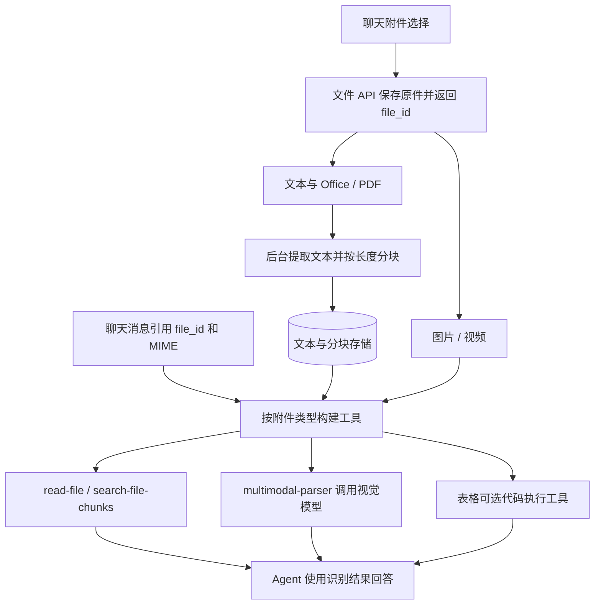

# PAI-RAG 附件识别与语音输入核查

2026-09-14。对象为工作区 `reference/PAI-RAG` 源码快照；该目录没有独立 `.git`，本文不将结论外推到上游所有分支或在线演示。Aituge 接入分析以 `aituge-main-cleanup`（远端 main `879d6fe` 加本轮清理）为准。本文是源码核查与设计建议，未运行真实模型、录音设备或完整文件处理部署，未修改业务代码。

## 结论

附件识别有实际前后端链路，值得复用的是“独立文件资源 → 按类型处理 → 按需注册 Agent 工具”。本地这份 PAI-RAG 没有找到已接通的语音输入：没有麦克风/录音入口，没有 ASR 转写接口，也没有把识别适配器挂入聊天 runtime。不能因为依赖存在语音接口类型，或允许上传音频，就认为语音输入已实现。

## 附件链路

- 前端 `frontend/app/attachments/upload_attachment_adapter.ts:23`：assistant-ui 自定义适配器，accept 为 `*/*`，聊天附件限制 10 MiB；POST `/api/files`，purpose 为 `chat_attachment`。上传返回服务端 ID，发送时用它替换客户端临时 ID；消息携带引用，不内嵌整份文件。前端上传进度是 0/100 两段状态。
- `frontend/app/runtime/usePaiChatThreadRuntime.tsx:768` 注册附件适配器。`frontend/app/api/files/route.ts` 经代理转发后端文件 API。
- 后端 `backend/api/v1/files.py:54`：保存文件，文本类投递 `process_file_resource_task`；图片、视频、音频等不提取文本，直接标记 succeeded。这里的 succeeded 对媒体表示文件资源就绪，不能等同“内容识别完成”。
- `backend/service/file/file_resource_service.py`：独立文件实体、原件存储、文本、分块与引用管理。附件不必先创建知识库。聊天附件默认有效期 7 天；长期会话引用必须另行设计生命周期。
- `backend/app/worker.py:168` 与 `backend/service/file/content_extractor.py`：纯文本直接解码；CSV/Excel 用 pandas；PDF/Office/Markdown 委托 pairag FileParser 的 attachment 模式。提取上限为 500,000 字符，达到 5,000 字符后建立 500 字符、50 字符重叠的片段。
- `backend/service/agent/agent_service.py:266`：读取最后一条用户消息的附件，按 MIME 分类，创建相应 FunctionTool；附件为空文字输入时补上读取/理解提示。表格代码工具另外扫描历史用户消息。
- `backend/tools/attachments/file_reader.py:34`：调用时重新查询解析结果，最多等 15 秒；单次给模型最多 5,000 字符。`search-file-chunks` 用关键词检索其他片段。关键词得分是空格分词后的出现次数，不是语义向量检索。
- `backend/tools/attachments/multimodal_parser.py:11`：将图片/视频原件转成 base64 data URI，发送给配置的视觉模型，把结果包装为工具返回。支持单独 vision_model_id；未指定时查默认多模态模型。这是视觉问答，当前提示要求描述不超过 200 字，不能直接当作完整 OCR 或稳定字段提取。
- Excel/CSV/XLS 还可以挂载代码沙箱工具，前提是相应服务启用。文本预览和表格计算是两个不同能力。

## 不能照搬的功能边界

| 发现 | 源码依据 | 接入时处理 |
| --- | --- | --- |
| 音频可以上传，但不转写 | files.py 不为音频投递提取；agent_service.py 仅把 image/video 单独路由，audio 落到 read-file | 新增转写处理器；不将上传成功展示为识别成功 |
| Excel 默认只提取第一张工作表 | content_extractor.py 的 `pd.read_excel(file_data)` 没有指定其他 sheet | 为每个 sheet 建立有名称的内容单元；保留行列定位 |
| 富文档解析异常可能显示为无文本/成功 | `_extract_via_pairag` 捕获异常返回 None；worker 对 None 仍标 succeeded | 区分 unsupported、failed、empty、ready，保留解析原因 |
| 本轮附件工具只针对最后一条消息构建 | parse_attachment_tools 的 `messages[-1]`；只有表格另外遍历历史 | 维护会话级有效附件集合，支持“继续看刚才的文件” |
| 文件读取工具按文件名定位 | file_reader.py 的 name_to_id 字典 | 同名文件会覆盖；工具以 file_id 为身份，名称仅展示 |
| 长文件搜索工具存在首次上传时序缺口 | 工具组装时只为已有 chunk 的文件注册；read-file 可能稍后才读到文本 | 等待就绪后统一建工具，或让搜索工具查询最新状态 |
| 扫描 PDF 未见明确 OCR 回退 | attachment 模式使用 SimplePdfReader(extract_images=False)，委托 fastpdf4llm；此链路没有显式扫描页检测与 OCR 服务调用 | 用实际扫描件验收；可复用 Aituge 已有 OCR 服务，不能依据知识库宣传推断附件能力 |
| 图片识别默认短描述，媒体消息格式与 Provider 相关 | multimodal_parser.py 的提示和 image_url/video_url 构造 | 通用问答与完整识别分开，统一模型适配层转换媒体协议 |

## 语音核查

检查了 frontend 自有 app/components/hooks/lib、后端 API/service/tools 以及文档中的录音、ASR、SpeechRecognition、MediaRecorder、dictation 等入口。

实际输入框 `frontend/components/assistant-ui/thread.tsx:359` 包含文字、附件和工具开关；发送区只有发送与停止生成。runtime 的 adapters 仅注册 attachments。安装的 assistant-ui 在 `src/runtimes/adapters/speech/SpeechAdapterTypes.ts:72` 定义了 SpeechRecognitionAdapter 的 listen/stop/cancel 与 transcript 事件，但本项目没有实现并接入该适配器。依赖的 speech 播放能力也不能用作语音输入实现的证据。

因此，本快照没有可直接移植的录音→转写→输入框流程。如果所指的是另一个在线演示或分支，需要以那个版本源码另行核查。

## 对 Aituge 的建议：明确新增边界

以下是建议设计，尚未实现：

1. 统一输入附件引用模型：file_id、名称、MIME、大小、处理状态。聊天与任务输入显式携带引用，并测试请求验证、会话保存/恢复、Worker 传递全过程；字典可以容纳字段不代表所有链路都支持。
2. 文件资源层拥有上传、存储、状态和解析产物；文档提取、图像理解、音频转写作为可替换处理器。长文档解析优先复用现有 TaskManager/Worker，不为了附件再引入第二套 Celery 调度。
3. 在运行组装层建立附件 ToolBundle，通过现有 `backend/tool/bundle.py` 和 `SingleAgentRunner` 的 tools 参数接入。沿用“read / search / analyze”工具语义，不把 PAI-RAG 的租户模型配置服务、知识库管理和整个 AgentService 搬进核心循环。
4. 区分通用内容识别与业务结构化提取。现有 `backend/invoice_recognition.py`、`backend/attendance_recognition.py` 及 Contract OCR 各有业务/解析规则；以后可以共享原件与文本产物，不能用视觉模型的短描述替代它们。
5. 语音输入先定义为“录音 → ASR 转文字 → 回填输入框 → 发送普通聊天消息”。前端拥有录音状态和编辑体验，转写服务拥有音频格式适配及识别结果。沿用文字聊天的后续 Agent 链路。实时双向语音是不同范围，当前不引入。
6. 上传音频文件后的内容分析可复用同一转写服务，并将转写结果作为附件文本；它与麦克风输入共享后端处理器，但拥有不同的前端交互和产物生命周期。

建议实施顺序：先确定输入协议和文件资源边界；接文本/PDF/图片并完成实际样本验收；接语音转写；再完善长文检索、跨轮附件和多 sheet 表格。验收至少覆盖无文字仅附件、解析中即发送、同名文件、跨轮追问、扫描 PDF、第二个工作表、录音取消/失败与转写后编辑。语音供应商及是否流式应在明确部署与体验要求后选择。
