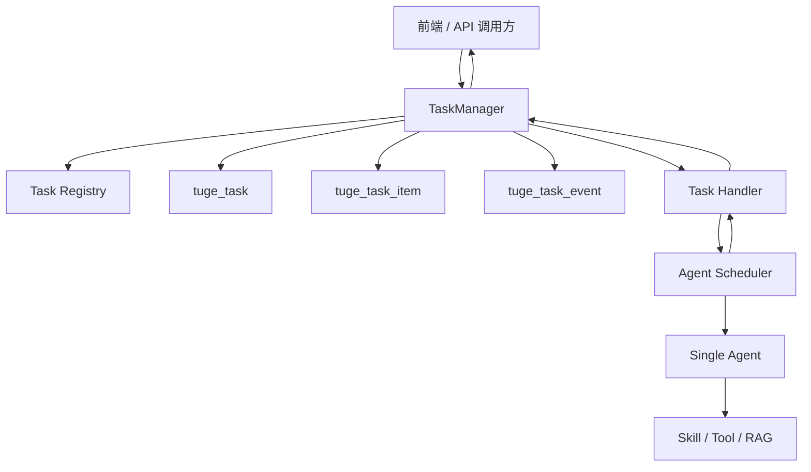
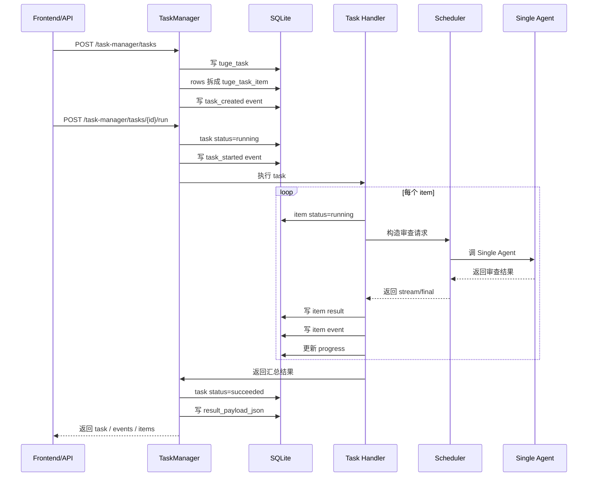

# TaskManager 任务复用技术说明

## 目标

TaskManager 层完成：

- 定义任务类型。
- 校验和保存业务输入。
- 把输入拆成可追踪的 task item。
- 选择 handler 和 agent 配置。
- 调用 Scheduler / Single Agent。
- 记录事件、进度、错误和最终结果。
- 给前端和后端接口提供统一查询入口。

例如“对一个表逐个做审查，然后输出一个结果”，应该在 TaskManager 层表达成：

```text
一个 task = 一次审查任务
多条 task item = 表里的每一行 / 每一个待审查对象
task events = 整个任务执行过程中的日志、步骤、错误和模型调用记录
task result = 汇总审查结果
item result = 每一行的审查结果
```

## 分层边界



TaskManager 可以复用底层 Scheduler 和 Single Agent，但不能把业务规则下沉到底层。比如表格审查、脚本选择、搜索填表、素材逐个打分，这些都属于 TaskManager 的业务任务编排。

## 任务复用方式

### 1. 复用 Task Definition

每类业务任务注册一个 `task_type`。调用方只需要传入 `task_type` 和业务输入，不需要知道底层挂了哪个 skill、tool 或 agent。

当前已有示例：

```text
media.script.generate
media.script.select
media.chat
table.audit
```

以后可以扩展：

```text
media.material.review
media.script.batch_select
form.search_fill
```

Task Definition 负责固定这些默认配置：

- `handler`
- `default_agent_id`
- `default_primary_skill`
- `default_candidate_skills`
- `default_tools`
- `default_datasets`

### 2. 复用 Handler

Handler 是任务执行器。当前已有两种执行模式：

```text
scheduler
一次 task -> 一次 Scheduler -> 一个整体结果

batch_item_scheduler
一次 task -> 多个 item -> 每个 item 调 Scheduler -> 汇总结果
```

`batch_item_scheduler` 会循环处理 `tuge_task_item`：

```text
读取 pending item
  -> 标记 running
  -> 调 Scheduler / Single Agent
  -> 写 item result
  -> 写 item event
  -> 更新 task progress
全部 item 完成
  -> 汇总 result_payload_json
  -> task succeeded
```

### 3. 复用输入结构

TaskManager 支持从以下输入字段自动拆 item：

```json
{
  "items": [],
  "rows": [],
  "script_candidates": []
}
```

对应关系：

```text
input_payload.items              -> item_type = item
input_payload.rows               -> item_type = table_row
input_payload.script_candidates  -> item_type = script_candidate
```

所以如果要做“表格逐个审查”，推荐传：

```json
{
  "task_type": "table.audit",
  "title": "客户名单合规审查",
  "input_payload": {
    "audit_goal": "逐行判断是否存在合规风险",
    "rows": [
      {
        "id": "row-001",
        "name": "A 公司",
        "description": "..."
      },
      {
        "id": "row-002",
        "name": "B 公司",
        "description": "..."
      }
    ]
  }
}
```

TaskManager 会创建：

```text
1 条 tuge_task
2 条 tuge_task_item
若干条 tuge_task_event
```

## 表格审查示例流程



第一版当前已经具备 `task / event / item` 的存储结构、查询接口和逐 item 调度 handler；后续新增表格审查、素材打分、候选脚本批量评估时，优先复用 `batch_item_scheduler`，不需要重做表结构。

## 数据表字段说明

### `tuge_task`

主任务表，一条记录代表一次业务任务。

| 字段 | 作用 |
| --- | --- |
| `id` | TaskManager 任务 id |
| `parent_task_id` | 父任务 id，用于任务拆分或子任务 |
| `root_task_id` | 根任务 id，根任务默认等于自己的 `id` |
| `task_key` | 业务侧幂等 key / 外部追踪 key |
| `task_type` | 任务类型，例如 `media.script.select`、`table.audit` |
| `status` | 生命周期状态：`created`、`running`、`succeeded`、`failed`、`cancelled` |
| `title` | 前端展示标题 |
| `handler_name` | 实际执行 handler，例如 `scheduler` |
| `input_payload_json` | 业务输入，不放大文件正文 |
| `result_payload_json` | 任务最终结果和汇总结果 |
| `error_payload_json` | 任务失败信息 |
| `definition_snapshot_json` | 创建任务时的 registry 配置快照 |
| `output_schema_json` | 调用方期望的输出结构 |
| `agent_id` | 调用的 Agent Profile |
| `thread_id` | SQLite 对话线程 id |
| `session_id` | Redis live context session id |
| `user_id` | 用户 id |
| `tenant_id` | 租户 id |
| `stream_mode` | 是否流式执行 |
| `current_run_id` | 当前执行尝试 id |
| `attempt_count` | 重试次数 |
| `progress_current` | 当前进度 |
| `progress_total` | 总进度 |
| `cancel_requested` | 取消标记，给长任务协作取消用 |
| `priority` | 任务优先级，后续并发调度用 |
| `created_at` | 创建时间 |
| `started_at` | 开始时间 |
| `finished_at` | 完成时间 |
| `expires_at` | 过期时间 |
| `updated_at` | 更新时间 |
| `metadata_json` | 前端来源、版本、request id 等附加信息 |

### `tuge_task_item`

任务对象表，一条记录代表一个待处理对象。表格审查时，一行就是一个 item。

| 字段 | 作用 |
| --- | --- |
| `id` | item id |
| `task_id` | 所属 task id |
| `run_id` | 所属执行尝试 id |
| `item_type` | item 类型，例如 `table_row`、`script_candidate` |
| `item_key` | 业务对象 key，例如行 id、候选脚本 id |
| `sequence` | item 顺序 |
| `status` | item 状态：`pending`、`running`、`succeeded`、`failed`、`skipped` |
| `input_payload_json` | 单个 item 的输入 |
| `result_payload_json` | 单个 item 的结果 |
| `error_payload_json` | 单个 item 的错误 |
| `created_at` | 创建时间 |
| `started_at` | 开始处理时间 |
| `finished_at` | 完成时间 |
| `updated_at` | 更新时间 |

### `tuge_task_event`

任务事件表，用来做前端时间线、Debug、Trace 和错误排查。

| 字段 | 作用 |
| --- | --- |
| `id` | event id |
| `task_id` | 所属 task id |
| `run_id` | 所属执行尝试 id |
| `parent_event_id` | 父事件 id |
| `sequence` | task 内事件顺序 |
| `event_type` | 事件类型，例如 `task_started`、`scheduler_request_built`、`agent_final` |
| `level` | 日志等级：`info`、`warning`、`error` |
| `stage` | 阶段，例如 `task_manager`、`agent_stream`、`result_save` |
| `step_id` | 稳定步骤 id |
| `step_index` | 步骤排序 |
| `item_id` | 关联 item id |
| `duration_ms` | 步骤耗时 |
| `token_usage_json` | token 使用量 |
| `error_code` | 结构化错误码 |
| `visible` | 是否默认展示给前端 |
| `message` | 可读日志 |
| `payload_json` | 有界事件详情 |
| `created_at` | 创建时间 |

## 查询接口

### 创建任务

```http
POST /task-manager/tasks
```

### 执行已有任务

```http
POST /task-manager/tasks/{task_id}/run
```

### 创建并执行

```http
POST /task-manager/run
```

### 流式创建并执行

```http
POST /task-manager/stream
```

### 查询任务

```http
GET /task-manager/tasks/{task_id}
```

### 查询任务对象

```http
GET /task-manager/tasks/{task_id}/items
```

### 查询事件

```http
GET /task-manager/tasks/{task_id}/events
```

## 前端如何展示

前端不需要理解 Agent 内部细节，只需要查三个接口：

```text
/task-manager/tasks/{task_id}
/task-manager/tasks/{task_id}/items
/task-manager/tasks/{task_id}/events
```

推荐展示：

```text
任务状态：tuge_task.status
任务进度：progress_current / progress_total
汇总结果：result_payload_json
逐项结果：tuge_task_item.result_payload_json
错误信息：error_payload_json
执行过程：tuge_task_event
```

## 和宁睿轩协作边界

TaskManager 可以继续做：

- 新 task_type。
- 新 handler。
- 新业务字段。
- 表格逐项处理。
- 任务状态、事件、错误、结果结构。
- 前端测试入口。

需要找宁睿轩确认后再改：

- Scheduler 请求结构。
- Scheduler stream event contract。
- Single Agent / ReactAgent 逻辑。
- Tool / Skill Registry 标准。
- 强制 tool-call 输出卡片协议。
- 多 Agent team / handoff / parallel 调度策略。

## 当前状态

当前第一版已经完成：

- `tuge_task` 主任务结构。
- `tuge_task_event` 事件结构。
- `tuge_task_item` 逐项对象结构。
- `media.script.generate` / `media.script.select` / `media.chat` 示例任务。
- Scheduler handler 复用。
- `batch_item_scheduler` 批处理 handler。
- `table.audit` 表格逐行审查测试任务。
- `table-audit` item 级审查 skill。
- 前端 TaskManager 测试面板。
- items / events / task 查询接口。

下一步如果要把“表格逐个审查”做成生产功能，建议补：

```text
input schema: 严格校验 rows / audit_goal / failure_policy
output schema: 严格校验 item result 和 summary
failure policy: fail_fast / continue 的前端展示
real table source: CSV/XLSX/数据库查询结果接入 Gateway
production skill: 替换测试版 table-audit 规则
```
